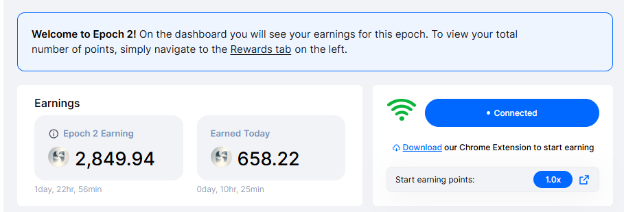
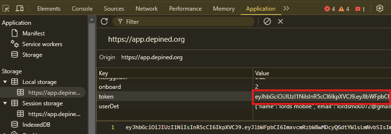

# Depined Auto Ping and Auto Reff



## Features

- **Auto Ping Widget Connection**
- **Auto Claim Tier**
- **Support multiple accounts**
- **Support Proxy usage**

## Prerequisites

- Node.js installed on your machine
- `tokens.txt` file containing token from depined platform follow instruction below to get:
- Open depined dashboard [https://app.depined.org/dashboard](https://app.depined.org/dashboard)
- Login With your email
- inspect or just F12, and find Application
- in local storage find `token` and copy all value.
  

## Installation

1. Clone the repository:

   ```sh
   git clone https://github.com/Hunga9k50doker/depined.git
   cd depined
   ```

2. Install the required dependencies:
   ```sh
   npm install
   ```
3. Input your tokens in `tokens.txt` file, one user per line;
   ```sh
   nano tokens.txt
   ```
4. optionally you can use proxy:

- paste proxy in `proxy.txt` format `http://username:password@ip:port`
  ```sh
  nano proxy.txt
  ```

5. Run the script:
   ```sh
   npm run start
   ```

## Additional Feature Auto Registration / Auto Referral

- ```bash
  npm run autoRef
  ```
- accounts information saved at `accountsReff.txt` and tokens auto saved to `tokensReff.txt`

## 

This project is licensed under the [MIT License](LICENSE).
